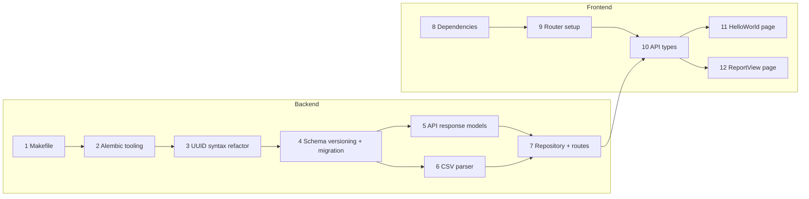

# Incremental Commit Plan for Staged Changes

The staged diff touches 23 files across backend and frontend. The plan below splits them into 12 small commits ordered by dependency so each commit leaves the codebase in a working state.

## Workflow

Most changes already exist in a git stash. For each commit:

1. **Pop the stash** to restore all pending changes.
2. **Keep only the files for the current commit** — unstage and revert everything else, delete any new files that belong to later commits.
3. **Refine** — review and adjust the kept changes as needed.
4. **Commit** — stage and commit the current step.
5. **Repeat** — pop the stash again for the next commit.

---

## Commit 1 — Makefile and frontend linting: add make targets + prettier [COMMITTED]

Standalone tooling change with no code dependencies. Adds `lint` (runs both backend and frontend), `lint-backend`, `lint-frontend`, `db-autogenerate`, and `db-upgrade` make targets. Installs prettier as a frontend dev dependency with a `.prettierrc` config (4-space indent, 120-char print width) to match existing code style. Fixes the 7 files that didn't conform to prettier formatting.

**Files:**

- [Makefile](../../../Makefile) — add `lint` (runs both), `lint-backend` (check-only), `lint-frontend` (auto-fix with `--fix` and `--write`), `db-autogenerate`, `db-upgrade` targets and update `.PHONY`
- [frontend/.prettierrc](../../../frontend/.prettierrc) — new config: `tabWidth: 4`, `printWidth: 120`
- [frontend/package.json](../../../frontend/package.json) — add `prettier` to devDependencies
- [frontend/package-lock.json](../../../frontend/package-lock.json) — lockfile update
- 7 source files reformatted to pass prettier (`AddToFilterModal.tsx`, `CreateFilterModal.tsx`, `ReportsContext.tsx`, `RulesContext.tsx`, `useFilterForm.ts`, `main.tsx`, `api.parser.ts`)

---

## Commit 2 — Alembic: add ruff post-write hooks and modernize migration template [COMMITTED]

Improves the migration authoring workflow. No impact on existing code.

**Files:**

- [backend/alembic.ini](../../../backend/alembic.ini) — add `ruff_format` and `ruff_lint` post-write hooks
- [backend/migrations/script.py.mako](../../../backend/migrations/script.py.mako) — replace `Union` with `|`, import `Sequence` from `collections.abc`

---

## Commit 3 — Backend models: update UUID column syntax to generic form [COMMITTED]

Pure refactor — changes `UUID(as_uuid=True)` to `UUID[uuid.UUID](as_uuid=True)` across all report-domain models. No schema change, no migration needed.

**Files:**

- [backend/app/db/reports/models.py](../../../backend/app/db/reports/models.py) — update all `mapped_column(UUID(...))` calls in `Report`, `Category`, `Filter`, `Transaction`, `Override`

---

## Commit 3.5 — Backend: add .env files for local development [COMMITTED]

Adds `.env.example` (committed) and `.env` (secret, local copy) so that Alembic migrations and other local commands can access required environment variables (`DATABASE_URL`, `ORIGIN_URL`) without Docker.

**Files:**

- [backend/.env.example](../../../backend/.env.example) — committed template with default local values
- `backend/.env` — local copy (not committed)

---

## Commit 4 — Backend: add schema versioning, new transaction fields, migration, and local dev setup [COMMITTED]

Adds schema versioning and new fields to the data model, with a migration that safely backfills existing data. Also adds `.env` support for running commands locally and a `db-downgrade` make target.

**Files:**

- [Makefile](../../../Makefile) — add `db-downgrade` target (rolls back one migration)
- [backend/app/config.py](../../../backend/app/config.py) — configure pydantic-settings to load from `.env` file
- [backend/app/db/reports/models.py](../../../backend/app/db/reports/models.py) — add `CURRENT_REPORT_SCHEMA_VERSION`, `CURRENT_TRANSACTION_SCHEMA_VERSION` constants; add `schema_version`, `data` (JSONB) to `Report`; add `schema_version`, `currency`, `state`, `balance`, `raw_data` (JSONB) to `Transaction`
- [backend/migrations/versions/x*2026_03_02_233153_ae2302096d52*.py](../../../backend/migrations/versions/x_2026_03_02_233153_ae2302096d52_.py) — new migration: adds columns as nullable, backfills `schema_version = 1`, makes non-null; changes `fee` from INTEGER to Float

---

## Commit 5 — Backend API: add versioned transaction response models [COMMITTED]

Introduces `TransactionV1Response` and `TransactionV2Response` with a discriminated union, and adds `schema_version` to report responses.

**Files:**

- [backend/app/api/reports/models.py](../../../backend/app/api/reports/models.py) — split `TransactionResponse` into V1/V2, add discriminator, update `ReportResponse`, `ReportFullResponse`, `ReportFilterFullResponse`

---

## Commit 6 — Backend: update CSV parser to preserve all rows and raw data

Removes the `Product != "Deposit"` filter and attaches original row data as `raw_data`.

**Files:**

- [backend/app/bank_statement_parser.py](../../../backend/app/bank_statement_parser.py) — rewrite `parse_statement()` to keep all rows and add `raw_data`

---

## Commit 7 — Backend: update repository DTOs and route handler for new fields

Wires the new fields through the create-report flow end-to-end.

**Files:**

- [backend/app/db/reports/repository.py](../../../backend/app/db/reports/repository.py) — add `type`, `product`, `currency`, `state`, `balance`, `raw_data` to `CreateReportTransactionDto` and `create_report()`
- [backend/app/api/reports/routes.py](../../../backend/app/api/reports/routes.py) — map new fields from parsed CSV records in `create_report_()`

---

## Commit 8 — Frontend: add TanStack Router and AG Grid dependencies

Package-only change. No source code modifications.

**Files:**

- [frontend/package.json](../../../frontend/package.json) — add `@tanstack/react-router`, `ag-grid-community`, `ag-grid-react`, `@tanstack/router-devtools`, `@tanstack/router-plugin`
- [frontend/package-lock.json](../../../frontend/package-lock.json) — lockfile update

---

## Commit 9 — Frontend: set up TanStack Router with file-based routing

Replaces the old provider-wrapped `App` entry point with router-based rendering. The existing `App` component is preserved at `/`.

**Files:**

- [frontend/vite.config.ts](../../../frontend/vite.config.ts) — add `TanStackRouterVite()` plugin
- [frontend/src/main.tsx](../../../frontend/src/main.tsx) — replace provider nesting with `RouterProvider`, add router type declaration
- [frontend/src/routes/\_\_root.tsx](../../../frontend/src/routes/__root.tsx) — root route wrapping `Outlet` in `ReportsProvider` / `RulesProvider` / `ModalProvider`
- [frontend/src/routes/index.tsx](../../../frontend/src/routes/index.tsx) — `/` route mapping to `App`
- [frontend/src/routeTree.gen.ts](../../../frontend/src/routeTree.gen.ts) — auto-generated route tree (include only the `/` and root routes at this point; the other routes will be added by later commits)

---

## Commit 10 — Frontend: update API types for new transaction fields

Adds the new backend fields to all three type layers.

**Files:**

- [frontend/src/services/api.types.ts](../../../frontend/src/services/api.types.ts) — add `type`, `product`, `fee`, `currency`, `state`, `balance` to `ApiTransaction`; make `completed_date` nullable
- [frontend/src/services/reports/api.types.parsed.ts](../../../frontend/src/services/reports/api.types.parsed.ts) — add matching camelCase fields to `Transaction`; make `completedDate` nullable
- [frontend/src/services/reports/api.parser.ts](../../../frontend/src/services/reports/api.parser.ts) — map all new fields in `parseApiReportTransaction()`

---

## Commit 11 — Frontend: add HelloWorld page (CSV upload and preview)

New page for uploading bank statement CSVs with a client-side AG Grid preview.

**Files:**

- [frontend/src/routes/hello.tsx](../../../frontend/src/routes/hello.tsx) — `/hello` route definition
- [frontend/src/components/HelloWorld.tsx](../../../frontend/src/components/HelloWorld.tsx) — full component (sidebar, file input, AG Grid preview, upload flow)
- `frontend/src/routeTree.gen.ts` — regenerated to include `/hello`

---

## Commit 12 — Frontend: add ReportView page (report detail and generation)

New page for viewing a report's categorised transactions and triggering report generation.

**Files:**

- [frontend/src/routes/reports.$reportId.tsx](../../../frontend/src/routes/reports.$reportId.tsx) — `/reports/:reportId` route definition
- [frontend/src/components/ReportView.tsx](../../../frontend/src/components/ReportView.tsx) — full component (sidebar, collapsible sections, AG Grid tables, generate button)
- `frontend/src/routeTree.gen.ts` — regenerated to include `/reports/$reportId`
