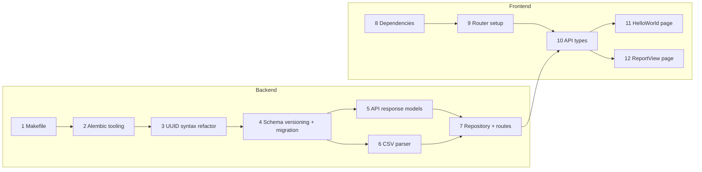

# Incremental Commit Plan for Staged Changes

The staged diff touches 23 files across backend and frontend. The plan below splits them into 12 small commits ordered by dependency so each commit leaves the codebase in a working state.

## Workflow

Most changes already exist in a git stash. For each commit:

1. **Pop the stash** to restore all pending changes.
2. **Keep only the files for the current commit** — unstage and revert everything else, delete any new files that belong to later commits.
3. **Refine** — review and adjust the kept changes as needed.
4. **Commit** — stage and commit the current step.
5. **Repeat** — pop the stash again for the next commit.

---

## Commit 1 — Makefile and frontend linting: add make targets + prettier [COMMITTED]

Standalone tooling change with no code dependencies. Adds `lint` (runs both backend and frontend), `lint-backend`, `lint-frontend`, `db-autogenerate`, and `db-upgrade` make targets. Installs prettier as a frontend dev dependency with a `.prettierrc` config (4-space indent, 120-char print width) to match existing code style. Fixes the 7 files that didn't conform to prettier formatting.

**Files:**

- [Makefile](../../../Makefile) — add `lint` (runs both), `lint-backend` (check-only), `lint-frontend` (auto-fix with `--fix` and `--write`), `db-autogenerate`, `db-upgrade` targets and update `.PHONY`
- [frontend/.prettierrc](../../../frontend/.prettierrc) — new config: `tabWidth: 4`, `printWidth: 120`
- [frontend/package.json](../../../frontend/package.json) — add `prettier` to devDependencies
- [frontend/package-lock.json](../../../frontend/package-lock.json) — lockfile update
- 7 source files reformatted to pass prettier (`AddToFilterModal.tsx`, `CreateFilterModal.tsx`, `ReportsContext.tsx`, `RulesContext.tsx`, `useFilterForm.ts`, `main.tsx`, `api.parser.ts`)

---

## Commit 2 — Alembic: add ruff post-write hooks and modernize migration template [COMMITTED]

Improves the migration authoring workflow. No impact on existing code.

**Files:**

- [backend/alembic.ini](../../../backend/alembic.ini) — add `ruff_format` and `ruff_lint` post-write hooks
- [backend/migrations/script.py.mako](../../../backend/migrations/script.py.mako) — replace `Union` with `|`, import `Sequence` from `collections.abc`

---

## Commit 3 — Backend models: update UUID column syntax to generic form [COMMITTED]

Pure refactor — changes `UUID(as_uuid=True)` to `UUID[uuid.UUID](as_uuid=True)` across all report-domain models. No schema change, no migration needed.

**Files:**

- [backend/app/db/reports/models.py](../../../backend/app/db/reports/models.py) — update all `mapped_column(UUID(...))` calls in `Report`, `Category`, `Filter`, `Transaction`, `Override`

---

## Commit 3.5 — Backend: add .env files for local development [COMMITTED]

Adds `.env.example` (committed) and `.env` (secret, local copy) so that Alembic migrations and other local commands can access required environment variables (`DATABASE_URL`, `ORIGIN_URL`) without Docker.

**Files:**

- [backend/.env.example](../../../backend/.env.example) — committed template with default local values
- `backend/.env` — local copy (not committed)

---

## Commit 4 — Backend: add schema versioning, new transaction fields, migration, and local dev setup [COMMITTED]

Adds schema versioning and new fields to the data model, with a migration that safely backfills existing data. Also adds `.env` support for running commands locally and a `db-downgrade` make target.

**Files:**

- [Makefile](../../../Makefile) — add `db-downgrade` target (rolls back one migration)
- [backend/app/config.py](../../../backend/app/config.py) — configure pydantic-settings to load from `.env` file
- [backend/app/db/reports/models.py](../../../backend/app/db/reports/models.py) — add `CURRENT_REPORT_SCHEMA_VERSION`, `CURRENT_TRANSACTION_SCHEMA_VERSION` constants; add `schema_version`, `data` (JSONB) to `Report`; add `schema_version`, `currency`, `state`, `balance`, `raw_data` (JSONB) to `Transaction`
- [backend/migrations/versions/x*2026_03_02_233153_ae2302096d52*.py](../../../backend/migrations/versions/x_2026_03_02_233153_ae2302096d52_.py) — new migration: adds columns as nullable, backfills `schema_version = 1`, makes non-null; changes `fee` from INTEGER to Float

---

## Commit 5 — Backend API: add versioned transaction response models [COMMITTED]

Introduces `TransactionV1Response` and `TransactionV2Response` with a discriminated union, and adds `schema_version` to report responses.

**Files:**

- [backend/app/api/reports/models.py](../../../backend/app/api/reports/models.py) — split `TransactionResponse` into V1/V2, add discriminator, update `ReportResponse`, `ReportFullResponse`, `ReportFilterFullResponse`

---

## Commit 5.5 — Makefile: make ESLint warnings fail the lint command [COMMITTED]

Adds `--max-warnings 0` to the ESLint invocation in `lint-frontend` so that warnings are treated as failures.

**Files:**

- [Makefile](../../../Makefile) — add `--max-warnings 0` to `npx eslint` in `lint-frontend`

---

## Commit 5.6 — Backend: set up pytest with unit and integration test structure [COMMITTED]

Set up pytest as the backend test framework with a clear separation between unit and integration tests. Integration tests now run against the real Alembic schema (`upgrade head` before tests and `downgrade base` in teardown), and use settings loaded from `.env`.

**Files:**

- [backend/pyproject.toml](../../../backend/pyproject.toml) — add `pytest` to dev dependencies; add `[tool.pytest.ini_options]` config with test paths and markers for `unit` and `integration`; add Ruff test-file ignores for assertions and common test patterns
- [backend/poetry.lock](../../../backend/poetry.lock) — lockfile update after adding pytest
- [Makefile](../../../Makefile) — add `test`, `test-unit`, `test-integration` targets
- `backend/tests/__init__.py` — empty init
- `backend/tests/unit/__init__.py` — empty init
- `backend/tests/integration/__init__.py` — empty init
- `backend/tests/unit/test_bank_statement_parser.py` — unit tests for the existing `parse_statement()` function
- `backend/tests/unit/test_transactions_service.py` — unit tests for the rule-matching logic
- `backend/tests/conftest.py` — shared fixtures that load DB URL from `TEST_DATABASE_URL` or `.env`, run Alembic upgrade/downgrade, and provide a rollback-isolated DB session per test
- `backend/tests/integration/test_reports_repository.py` — integration tests for report CRUD against a real database
- [backend/app/db/reports/models.py](../../../backend/app/db/reports/models.py) — align SQLAlchemy model with migrated schema (`Transaction.schema_version` default + `fee` as `Float`) so inserts pass against migrated DB
- [backend/app/db/base.py](../../../backend/app/db/base.py) — switch `declarative_base` import to `sqlalchemy.orm` to remove SQLAlchemy deprecation warnings

---

## Commit 6 — Backend: update CSV parser to preserve all rows and raw data [COMMITTED]

Removes the `Product != "Deposit"` filter and attaches original row data as `raw_data`.

**Files:**

- [backend/app/bank_statement_parser.py](../../../backend/app/bank_statement_parser.py) — rewrite `parse_statement()` to keep all rows and add `raw_data`
- `backend/tests/unit/test_bank_statement_parser.py` — update parser unit tests for the new behavior (no row filtering, `raw_data` included)
- `backend/tests/integration/test_reports_routes.py` — integration tests for `POST /reports` uploading real CSV files and asserting both API response and persisted DB rows
- `backend/tests/integration/fixtures/report_upload.csv` — CSV fixture used by endpoint integration tests
- `backend/tests/conftest.py` — add `TestClient` fixture with DB dependency override for endpoint integration tests
- [backend/pyproject.toml](../../../backend/pyproject.toml) and [backend/poetry.lock](../../../backend/poetry.lock) — add `httpx` (dev dependency) required by FastAPI/Starlette `TestClient`

---

## Commit 7 — Backend: update repository DTOs and route handler for new fields [COMMITTED]

Wires the new fields through the create-report flow end-to-end.

**Files:**

- [backend/app/db/reports/repository.py](../../../backend/app/db/reports/repository.py) — add `type`, `product`, `currency`, `state`, `balance`, `raw_data` to `CreateReportTransactionDto` and `create_report()`
- [backend/app/api/reports/routes.py](../../../backend/app/api/reports/routes.py) — map new fields from parsed CSV records in `create_report_()`
- [backend/app/db/reports/models.py](../../../backend/app/db/reports/models.py) — add `type` and `product` fields to `Transaction` so routed values are persisted
- `backend/tests/integration/fixtures/report_upload.csv` — include realistic upload column order and new stage 7 columns (`Type`, `Product`, `Currency`, `State`, `Balance`)
- `backend/tests/integration/test_reports_routes.py` — assert endpoint persists new fields and `raw_data` content to DB

---

## Commit 8 — Frontend: add TanStack Router and AG Grid dependencies [COMMITTED]

Package-only change. No source code modifications.

**Files:**

- [frontend/package.json](../../../frontend/package.json) — add `@tanstack/react-router`, `ag-grid-community`, `ag-grid-react`, `@tanstack/router-devtools`, `@tanstack/router-plugin`
- [frontend/package-lock.json](../../../frontend/package-lock.json) — lockfile update
- [frontend/.nvmrc](../../../frontend/.nvmrc) — bump Node version to `v20.19.0` to satisfy TanStack engine requirements

### Table Library Investigation (Google Sheets-like UX)

Goal: pick a frontend grid that supports:

- Google Sheets-like **multi-cell copy** (multiple rows/columns at once)
- **row-level actions**
- report structure where **categories are sections**, and **filters + transactions are rows**
- **no AG Grid Enterprise subscription**
- **no inline editing**

**Options evaluated**

- **AG Grid (`ag-grid-react`)**
  - Pros: mature table component; good copy/selection UX; easy action column per row; strong performance and docs.
  - Cons: row grouping/tree data/master-detail style features are tied to Enterprise, so we must avoid those patterns.
  - Fit for this project: still viable in Community edition if we model categories as UI sections and render plain row tables inside each section.

- **Glide Data Grid (`@glideapps/glide-data-grid`)**
  - Pros: very spreadsheet-like interaction model, strong copy behavior, MIT/open-source (no enterprise split risk).
  - Cons: more custom wiring for per-row actions and sectioned report UX; smaller ecosystem than AG Grid.
  - Fit for this project: strongest fallback if AG Grid Community misses required copy UX in practice.

- **TanStack Table**
  - Pros: lightweight, headless, highly flexible.
  - Cons: not a ready-made spreadsheet grid; most spreadsheet UX must be built manually.
  - Fit for this project: not ideal for your stated goal unless we intentionally want to build a custom table system from scratch.

- **Handsontable**
  - Pros: spreadsheet-first UX.
  - Cons: commercial licensing is typically required for production/commercial use.
  - Fit for this project: technically strong but license cost/constraints make it a less practical default choice.

**Recommendation**

Proceed with **AG Grid** for this codebase now.

For your stated needs, AG Grid gives the fastest path:

- multi-row/multi-column copy via range selection + clipboard support
- row-level actions via a dedicated actions column (button/menu cell renderer)
- no edit complexity (we can keep cells read-only and still support copy/selection UX)

Implementation notes for upcoming frontend commits:

- use **categories as separate sections** (not grouped rows)
- inside each section, render rows for **filters** and **transactions** in read-only grids
- include an **actions** column for row operations
- avoid Enterprise-only AG Grid features (grouping/tree/master-detail)
- if Community copy UX falls short in a quick prototype, switch to Glide Data Grid before building deeper UI

---

## Commit 9 — Frontend: set up TanStack Router with file-based routing [COMMITTED]

Replaces the old provider-wrapped `App` entry point with router-based rendering. The existing `App` component is preserved at `/`.

**Files:**

- [frontend/vite.config.ts](../../../frontend/vite.config.ts) — add `tanstackRouter()` plugin
- [frontend/src/main.tsx](../../../frontend/src/main.tsx) — replace provider nesting with `RouterProvider`, add router type declaration
- [frontend/src/routes/\_\_root.tsx](../../../frontend/src/routes/__root.tsx) — root route wrapping `Outlet` in `ReportsProvider` / `RulesProvider` / `ModalProvider`
- [frontend/src/routes/index.tsx](../../../frontend/src/routes/index.tsx) — `/` route mapping to `App`
- [frontend/src/routeTree.gen.ts](../../../frontend/src/routeTree.gen.ts) — auto-generated route tree (include only the `/` and root routes at this point; the other routes will be added by later commits)
- [frontend/package.json](../../../frontend/package.json) and [frontend/package-lock.json](../../../frontend/package-lock.json) — `typescript-eslint` toolchain compatibility update so linting supports the current TypeScript version in use

---

## Commit 10 — Frontend: update API types for new transaction fields [COMMITTED]

Adds the new backend fields to all three type layers.

**Files:**

- [frontend/src/services/api.types.ts](../../../frontend/src/services/api.types.ts) — add `type`, `product`, `fee`, `currency`, `state`, `balance` to `ApiTransaction`; make `completed_date` nullable
- [frontend/src/services/reports/api.types.parsed.ts](../../../frontend/src/services/reports/api.types.parsed.ts) — add matching camelCase fields to `Transaction`; make `completedDate` nullable
- [frontend/src/services/reports/api.parser.ts](../../../frontend/src/services/reports/api.parser.ts) — map all new fields in `parseApiReportTransaction()`

---

## Commit 11 — Frontend: add upload page (CSV upload and preview) [COMMITTED]

New page for uploading bank statement CSVs with a client-side AG Grid preview.

**Files:**

- [frontend/src/routes/upload.tsx](../../../frontend/src/routes/upload.tsx) — `/upload` route definition
- [frontend/src/components/ReportUploadPage.tsx](../../../frontend/src/components/ReportUploadPage.tsx) — `ReportUploadPage` component with a compact form in a dedicated sidebar and AG Grid preview area, styled with Tailwind utility classes (no inline styles)
- [frontend/package.json](../../../frontend/package.json) and [frontend/package-lock.json](../../../frontend/package-lock.json) — add Tailwind dependencies for Vite (`tailwindcss`, `@tailwindcss/vite`)
- [frontend/package.json](../../../frontend/package.json) and [frontend/package-lock.json](../../../frontend/package-lock.json) — add TanStack Query dependency (`@tanstack/react-query`) for upload mutation handling
- [frontend/vite.config.ts](../../../frontend/vite.config.ts) — register Tailwind Vite plugin
- [frontend/src/index.css](../../../frontend/src/index.css) — switch to Tailwind entrypoint (`@import "tailwindcss";`)
- [frontend/src/services/reports/apiService.ts](../../../frontend/src/services/reports/apiService.ts) — add robust upload error handling so submit failures show actionable messages in the upload UI
- [frontend/.env.example](../../../frontend/.env.example) — frontend env template with `VITE_API_URL`
- `frontend/.env` — local frontend env file for development
- [frontend/src/routes/\_\_root.tsx](../../../frontend/src/routes/__root.tsx) and [frontend/src/services/reports/queries.ts](../../../frontend/src/services/reports/queries.ts) — set up `QueryClientProvider` and `useCreateReportMutation` so upload submit uses TanStack Query mutation flow instead of context action calls
- `frontend/src/routeTree.gen.ts` — regenerated to include `/upload`

---

## Commit 12 — Frontend: add shared sidebar layout with reports list and report detail page [COMMITTED]

Introduces a TanStack Router layout route (`/_app`) with a persistent sidebar showing all reports and a "New Upload" link. The upload page and a new report detail page are children of this layout. The upload page form is moved into the main content area (no longer in the sidebar). Clicking a report in the sidebar navigates to `/reports/:reportId` which displays the report at the filter level — each category is a section with an AG Grid showing filter rows (Amount, Description, Txns columns). A "Copy" button per category copies all filters as TSV (amount, name, category) for pasting into Google Sheets. Clicking a filter row opens an inline side panel on the right showing that filter's transactions in a separate AG Grid; both the main report and the transaction panel are usable simultaneously (no modal overlay). The layout uses flex with a max-width of 1800px to accommodate the side panel.

**Files:**

- [frontend/src/routes/\_app.tsx](../../../frontend/src/routes/_app.tsx) — new pathless layout route rendering `AppSidebar` + `<Outlet />` in a flex layout (sidebar 300px, content flex-1, max-w-[1800px])
- [frontend/src/routes/\_app/upload.tsx](../../../frontend/src/routes/_app/upload.tsx) — moved from `routes/upload.tsx`; child of `/_app` layout
- [frontend/src/routes/\_app/reports.$reportId.tsx](../../../frontend/src/routes/_app/reports.$reportId.tsx) — `/reports/:reportId` route definition, reads `reportId` param
- `frontend/src/routes/upload.tsx` — deleted (moved into `_app/`)
- [frontend/src/components/AppSidebar.tsx](../../../frontend/src/components/AppSidebar.tsx) — new sidebar component: fetches reports list via `useReportsQuery`, renders `<Link>` elements with active highlighting, includes "New Upload" button
- [frontend/src/components/ReportDetailPage.tsx](../../../frontend/src/components/ReportDetailPage.tsx) — new component: fetches single report via `useReportQuery`; renders categories as sections with filter-level AG Grids (Amount, Description, Txns); per-category "Copy" button for TSV clipboard export; clicking a filter row opens an inline sticky side panel (`TransactionPanel`) showing that filter's transactions in a full AG Grid; panel and main content are side-by-side (no overlay) so both can be interacted with simultaneously; clicking X or same row closes the panel
- [frontend/src/components/ReportUploadPage.tsx](../../../frontend/src/components/ReportUploadPage.tsx) — simplified: removed outer `min-h-screen` layout wrapper and `<aside>` sidebar (now provided by layout route); upload form rendered inline as a card above the CSV preview grid
- [frontend/src/services/reports/queries.ts](../../../frontend/src/services/reports/queries.ts) — added `useReportsQuery` (list) and `useReportQuery` (single report) TanStack Query hooks
- `frontend/src/routeTree.gen.ts` — regenerated with `/_app` layout, `/_app/upload`, `/_app/reports/$reportId`
