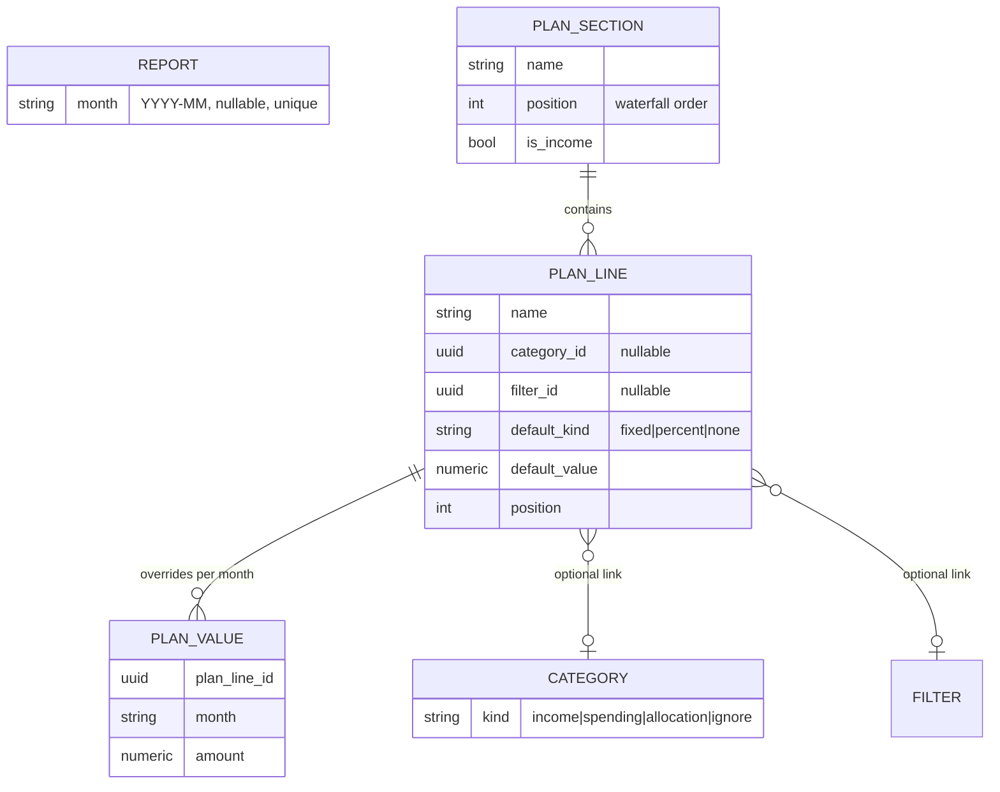

# Monthly Plan & Summary Features

Expand the spending tracker with two features: a monthly planning grid (replacing the budget Google Sheet) and a month-by-month plan-vs-actual summary grid (replacing the summary Google Sheet), built on the existing category/filter taxonomy.

## Decisions made together

- Reports get a **month** field; one report = one month (unique constraint); existing reports get backfilled by hand in the UI.
- Categories get a **kind**: `income | spending | allocation | ignore` (Investments and Savings are allocation; used for FINAL / SPENDING / SPENDING %).
- Plan lines optionally link to a category (e.g. Food) or a filter (e.g. Mortgage); unlinked lines (Split) exist too and stay plan-page-only.
- Line defaults: fixed cash amount, or a percentage of the left-over row above the line's section (for the first section after income, that's total income). Percentages recompute **live**; a manual cell edit overrides the default for that month only.
- Summary rows = the actuals taxonomy (categories with filter breakdown). Submitted months show Plan and Actual columns with a toggle (both / plan only / actual only); future or report-less months show plan only.
- Flat 2-level structure (category → filter) is enough; no sub-groups.
- The income section is marked with an explicit `is_income` flag on plan sections (not a position convention).
- Uncategorized transactions appear in the summary as an **Unidentified** row per month, counted in FINAL / SPENDING — totals always reflect real money out.
- A month whose report exists but was never generated (`report.data` null) is treated as having **no actuals**: plan-only column in the summary.
- Grid tech: the `/plan` grid is a hand-rolled table (mixed row types don't fit AG Grid Community); `/summary` uses AG Grid.
- Build order: plan feature first, then summary; many small vertical slices, each committable and visible in the UI.

## Schema changes ([backend/app/db/models.py](../../../backend/app/db/models.py) + Alembic migrations)

Migrations are created incrementally, one per build step that needs new schema (see build order below). `plan_value` stores only manual entries/overrides — defaults are computed, never persisted. `category.kind` defaults on migration: Income → income, Ignore → ignore, Investments/Savings → allocation, rest → spending.

## Backend (follow existing repository/service/route layering)

- **Reports**: accept `month` on create and PATCH; expose in responses.
- **Categories**: accept `kind` on create/PATCH.
- **Plan** (new `plan_routes.py`, `plan_service.py`, repository):
  - CRUD for sections and lines (name, position, link, default).
  - `PUT /plan/lines/{id}/values/{month}` set override; `DELETE` to revert to default.
  - `GET /plan?from=YYYY-MM&to=YYYY-MM` returns the computed grid: per month per line the resolved amount (override or default), `is_override` flag, and computed left-over per section. Waterfall logic lives in `plan_service` — single source of truth.
- **Summary** (new `summary_routes.py`, `summary_service.py`):
  - `GET /summary?from&to` returns, per month: plan values mapped onto linked categories/filters (summing when several lines share a target), and (if a **generated** report with that month exists) actuals aggregated from `report.data` mapped to live taxonomy by stable identity (`rule_filter_id` / manual-filter `category_id`), plus an Unidentified row, excluding income/ignore rows; plus FINAL, SPENDING, SPENDING % computed from category kinds. Amounts keep DB sign; the frontend flips at parse time.

## Frontend (TanStack Router, backendClient + Zod, TanStack Query, hand-rolled plan grid, AG Grid summary)

- **Report upload/detail**: month picker on [ReportUploadPage.tsx](../../../frontend/src/components/ReportUploadPage.tsx); editable month on [ReportDetailPage.tsx](../../../frontend/src/components/report-detail/ReportDetailPage.tsx) for backfilling existing reports.
- **`/plan` page**: hand-rolled sheet-like table — months as columns, sections/lines/left-over as rows. Click a cell to override; overridden cells visually distinct with a revert action. Section/line management UI (add/reorder lines, link to category/filter, set default).
- **`/summary` page**: AG Grid — months as columns (two sub-columns Plan | Actual for submitted months, one Plan column otherwise), category rows expandable to filters, FINAL/SPENDING/SPENDING % pinned at bottom, toggle for both/plan-only/actual-only.
- Sidebar ([AppSidebar.tsx](../../../frontend/src/components/AppSidebar.tsx)): links to Plan and Summary.

## Build order

Vertical slices: every step is committable, introduces no dead code, and ends with something visible in the UI. Migrations are added only in the step that first uses the schema. Plan feature first, then report months, then summary.

**Tracking progress:** each step heading carries a status tag — `[PENDING]`, `[IN PROGRESS]`, or `[COMMITTED]` (same convention as the 2026-03-02 plan). Update the tag when starting or committing a step, and append notes under a step if the implementation deviated from the description.

**For implementers:** each step links to a self-contained spec file in this folder. Read [conventions.md](conventions.md) (codebase patterns, workflow) plus the step file before starting; the step files assume no other context.

### Phase 1 — Plan grid

#### [Step 1 — Plan sections](step-01-plan-sections.md) [COMMITTED]

Migration: `plan_section` (name, position, is_income). CRUD API + new `/plan` page (sidebar link) listing sections as rows with add / rename / reorder / delete, income section marked.

**Post-step refactor** (do before or alongside Step 2):

- [ ] Split `PlanPage.tsx` (~250 lines) into `SectionRow` + `CreateSectionForm` components with a `usePlanSectionsState` hook — Step 2 nests lines inside sections and will fight the monolith; mirror the categories-panel decomposition (`CreateCategoryForm`, `SortableCategoryCard`, `useCategoriesPanelState`).
- [ ] (BEHAVIOR CHANGE) Backport plan's stricter input validation to category/filter schemas (trimmed non-empty names, `position >= 1` + upper-bound check) — siblings can still persist blank names and position gaps that plan rejects. Separate commit.
- [ ] (BEHAVIOR CHANGE) Route category/filter client mutations through `parseAxiosError` — they surface raw Axios messages while report/plan mutations show the backend `detail`. Separate commit.

Deferred by choice: `update_plan_section` taking an entity instead of an id (avoids a double fetch for position validation); plan's `APIRouter(prefix="/plan")` style vs siblings' bare routers (forward-compatible with `GET /plan?from&to`).

#### [Step 2 — Plan lines](step-02-plan-lines.md) [PENDING]

Migration: `plan_line` (section FK, name, position). CRUD API + UI to manage lines within sections on the plan page.

#### [Step 3 — Month columns + fixed defaults](step-03-month-columns-fixed-defaults.md) [PENDING]

Migration: add `default_kind` (`none | fixed | percent` — full enum created now, `percent` enabled in step 6) and `default_value` to `plan_line`. UI to set a fixed default on a line; the page becomes a real grid — month range as columns, default values filling cells, per-section totals.

#### [Step 4 — Per-month overrides](step-04-per-month-overrides.md) [PENDING]

Migration: `plan_value`. Click a cell to enter/edit a value for that month; overridden cells visually distinct with revert-to-default. `GET /plan?from&to` returns resolved amounts + `is_override`.

#### [Step 5 — Waterfall](step-05-waterfall.md) [PENDING]

Computed "Left over" row after each non-income section (income total minus sections above). Backend `plan_service` owns the computation.

#### [Step 6 — Percent defaults](step-06-percent-defaults.md) [PENDING]

Enable the `percent` default kind (enum value already exists): line default computes live as % of the left-over row above its section (total income for the first section after income). Overrides from step 4 still win. No migration.

### Phase 2 — Report months

#### [Step 7 — Month on existing reports](step-07-report-month.md) [PENDING]

Migration: `report.month` (nullable, unique). PATCH support + editable month field on the report detail page; month shown next to reports in the sidebar. Backfill existing reports by hand here.

#### [Step 8 — Month on upload](step-08-upload-month.md) [PENDING]

`POST /reports` accepts month; month picker on the upload page.

### Phase 3 — Summary

#### [Step 9 — Actuals summary v1](step-09-actuals-summary.md) [PENDING]

New `/summary` page (sidebar link): months as columns, one column per month, category totals aggregated from each month's report. `GET /summary?from&to`.

#### [Step 10 — Filter breakdown](step-10-filter-breakdown.md) [PENDING]

Category rows expand to show per-filter actuals.

#### [Step 11 — Category kinds](step-11-category-kinds.md) [PENDING]

Migration: `category.kind` (defaults per mapping above) + kind selector in the categories panel. Summary now excludes income/ignore rows and gains pinned FINAL / SPENDING / SPENDING % rows.

#### [Step 12 — Plan line links](step-12-plan-line-links.md) [PENDING]

Migration: add nullable `category_id` / `filter_id` to `plan_line` + link picker in the plan page's line settings. (Deferred to here so the links are used immediately by the next step.)

#### [Step 13 — Plan in summary](step-13-plan-in-summary.md) [PENDING]

Reported months show Plan | Actual sub-columns (plan mapped via line links); months without a report show a single Plan column.

#### [Step 14 — View toggle](step-14-view-toggle.md) [PENDING]

Page-level toggle: both / plan only / actual only.
